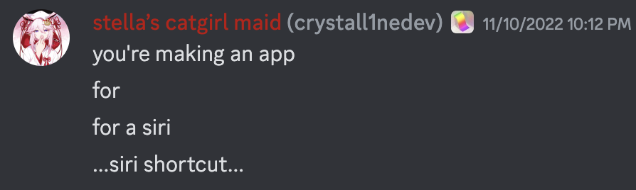

  
  <h1>Battery Webhook</h1>

Send your battery info to popular services using webhooks!

## Usage and compatibility
Check out [Battery Webhook's documentation](https://docs.thatstel.la/battery-webhook) to learn more about using the app.

You can download Battery Webhook on the [App Store](https://apps.apple.com/us/app/battery-webhook/id6472404778) or on the [GitHub Releases](https://github.com/ThatStella7922/battery-webhook/releases) page!

You can also find Battery Webhook on [SideStore](https://sidestore.io/), just add the **ThatStella7922 source** from the trusted sources, then install the app!

If you'd like access to beta builds of Battery Webhook on TestFlight built from every new commit, consider [subscribing to my Patreon's](https://www.patreon.com/ThatStella7922) Quad-core tier.\
This helps cover my living expenses and shows your interest in the app!

## Development
### Feature Status
- [x] Fully modern, built in Swift and SwiftUI
- [x] Device info functions (name, battery info, etc)
- [x] Date saving, formatting, comparison, etc
- [x] Full configuration infrastructure with UserDefaults
- [x] Share data container for use with the SiriKit Intents app extension
- [x] Full programmatic building of various embeds in JSON format
- [x] HTTP interaction with webhooks
- [x] Manual sending of battery info in the app
- [x] Automations support on iOS with Shortcuts Automations
- [x] Automations support on macOS with IOPowerManagement events and IOKit for high power efficiency
- [x] Siri Shortcuts support on all compatible platforms
- [x] Menu bar extra on macOS
- [X] Supports UPSes (Uninterruiptible Power Supplies) for desktop Macs

### Building
Set the development team and bundle identifier in `dcbattwebhook-swift/Codesigning.xcconfig`, then build with Xcode.

Documentation is provided as DocC for most functions, or code comments

## Credits
Built with 💜 by ThatStella7922

### Contributors
Battery Webhook would not be possible without its contributors:
- my [Eva Luna](https://github.com/crystall1nedev)
  - Feature ideas, occasional code help and *lots* of encouragement when I was feeling down, as well as her reaction being the entire reason I began this project: 
- [Dhinak G](https://github.com/dhinakg)
  - watchOS compatibility, Mac hardware information and general knowledge
- [João Eduardo](https://github.com/joaodforce)
  - Early pointers with how to interact with iOS and Apple's development tools

### App Icon
The app icon uses modified assets from [DazzleUi](https://dazzleui.gumroad.com/l/dazzleiconsfree?ref=svgrepo.com) under the CC Attribution License.\
This does not imply endorsement or sponsorship of Battery Webhook by DazzleUi.
