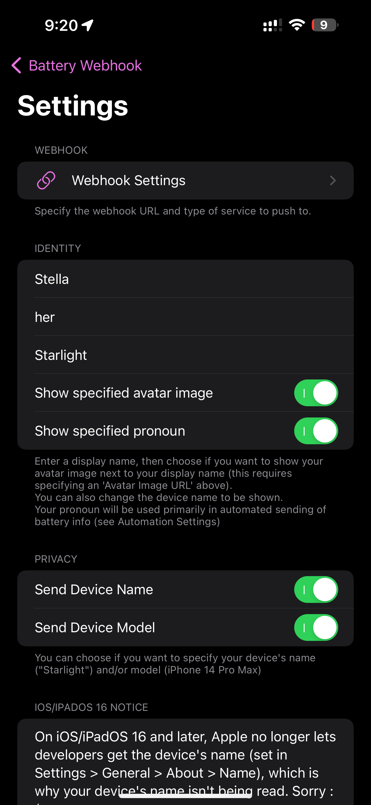
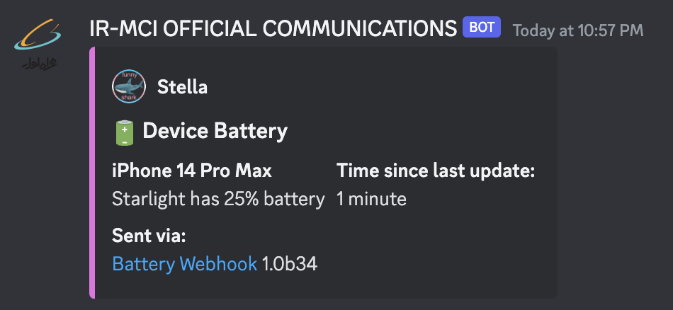

  
  <h1>Battery Webhook</h1>

Send your battery info to popular services using webhooks!

## Usage
Install and run, then configure in the Settings page:

  

Once that's done, you can manually send the battery info to your configured webhook:

## Feature Status
- [x] UI built with SwiftUI
- [x] Device info functions
- [x] Work around iOS 16+ not giving the user-set device name by letting the user set a device name in Battery Webhook
- [x] Date saving, formatting, comparison, etc
- [x] Full configuration infrastructure using UserDefaults
- [x] Building Discord embed with JSON
- [x] HTTP interaction with Discord webhook
- [x] Manual sending of battery info
- [x] Send battery info using Shortcuts
  - [x] Update MessageBuilder.swift to support different power events
- [x] Automations support with Shortcuts Automations
- [x] macOS-specific UI elements (CommandMenu and MenuBarExtra)
- [ ] Preview how the embed will show
  - Discord planned
- [ ] Support services other than Discord (config infra is there but need to create constructors for whatever format other services expect)
- [ ] ?

## Compatibility and Dependencies
- iOS/iPadOS 15.0 or later
- watchOS 8 or later
- tvOS 15.0 or later
- macOS 13.0 or later
- visionOS 1.0 or later

Support for the Shortcuts app requires iOS/iPadOS/watchOS 16 or later.

## Building
Open in Xcode, change PROJECT_IDENTIFIER at the bottom of project build settings, set codesign identity, then build.

Documentation is provided as DocC for most functions, or code comments

## Credits
### App Icon
The app icon uses modified assets from [DazzleUi](https://dazzleui.gumroad.com/l/dazzleiconsfree?ref=svgrepo.com) under the CC Attribution License.\
This does not imply endorsement or sponsorship of Battery Webhook by DazzleUi.