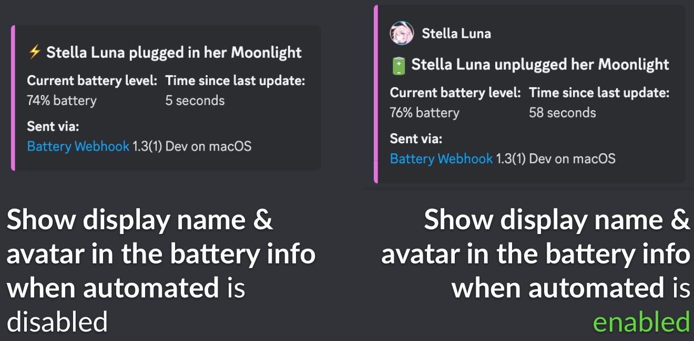

# Further configuring your Discord webhook

You'll notice that the **Settings** page in Battery Webhook has a few options we didn't cover in the last page!

**Discord Webhook URL** should always contain a Discord Webhook URL. This is where the battery info is actually sent to. If you would like to send to multiple webhook URLs at the same time, list them separated by commas.

**Avatar Image URL** allows you to provide a custom image to the webhook to be shown with your display name. If none is provided, Battery Webhook will substitute a Discord-provided generic avatar image. You can get the avatar image URL for your Discord account using Discord bots like Tatsumaki or CorpBot.

**Show display name & avatar in the battery info when automated** will add your display name and avatar into the battery info when sending is triggered by an automation.\
You can enable and disable it as desired.

**Override the webhook's preset avatar & name with my own** is a bit of a special one. Discord webhooks usually have a single set name and avatar, and enabling this option will replace those with _your_ display name and avatar. For example, see this image with the option disabled (uses the webhook's preset avatar and name):\
.png>)\
Now, see the image with the option enabled (uses _your_ display name and avatar):\
.png>)

***

Now that you know all of the options for your webhook type, see [Setting up automations](../../setting-up-automations.md) to learn how to automate sending of battery info, or see [Further configuring Battery Webhook](../../further-configuring-battery-webhook.md) to learn about all of the app's options!
